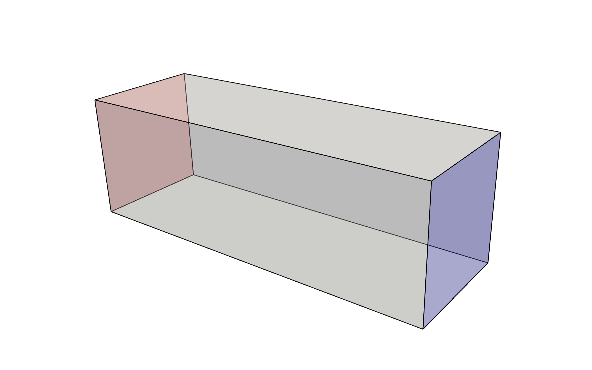
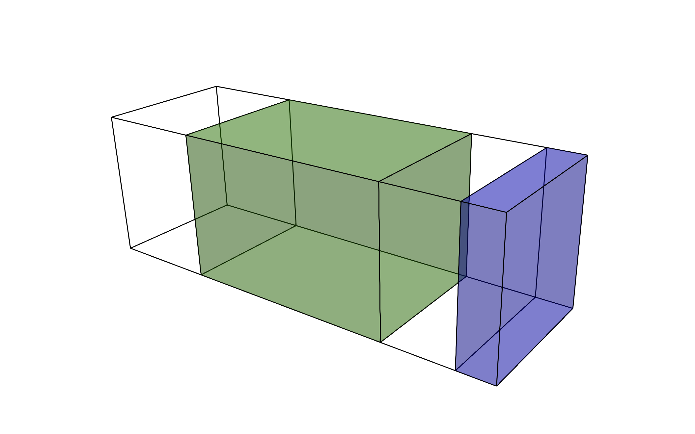

# Static Mixer {#mixer}

\tableofcontents

## Optimization problem

This tutorial aims to replicate the passive mixer problem by 
[C. S. Andreasen et al. 2009](https://doi.org/10.1002/fld.1964).

The goal of this optimization problem is to design a structure capable of
mixing fluids in a static manor, that is to say, without the use of moving
parts.

We begin by considering  a square duct seen in the figure below.


Fluid enters the domain upstream and is ejected downstream, with all other
boundary being considered solid walls. 
In addition, we consider a scalar field, representative of the two species one desires to
have mixed (denoted in red and blue in the above figure). 
The species enters the mixer upstream, originally separated into two distinct species. 
The goal of
the optimization problem is to design the interior structure such that the
two species are as homogeneous as possible in the downstream location 
(denoted in green in the above figure). The
system is assumed to be low Reynolds number, implying a steady state solution
can be found, and high Peclet number, implying the mixing must be performed
by advective transport, not diffusion.

In this tutorial you will learn how to
- [Formally define this problem in the context of a topology optimization problem.](@ref mixer_optimization_problem)
- [Mesh the domain.](@ref mixer_meshing)
- [Set up a fluid, scalar and their respective adjoint simulations.](@ref mixer_case_file)
- [Define different domains](@ref mixer_domains)
- [Define the objective functions and constraints being solved.](@ref mixer_objectives)
- [Define a mapping cascade.](@ref mixer_mapping)
- [Define optimization parameters for the MMA algorithm.](@ref mixer_MMA)
- [Prepare a driver to solve the optimization problem.](@ref mixer_driver)
- [Solve the optimization problem.](@ref mixer_solve)
- [Post process the results.](@ref mixer_post)

## Defining the optimization problem {#mixer_optimization_problem}



We define the duct as the domain \f$\Omega\f$.
The equations being solved in \f$\Omega\f$ are the incompressible Navier-Stokes
equations with an additional passive scalar equation

\f[
    {\frac {\partial \mathbf {u} }{\partial t}}
    + (\mathbf {u} \cdot \nabla)\mathbf {u}
    =
    -\nabla p
    +{\frac {1}{Re}}\nabla ^{2}\mathbf {u}
    +  \mathbf{f}
    - \chi \mathbf{u}, \\
    \nabla \cdot \mathbf {u} = 0, \\
    {\frac {\partial \phi }{\partial t}}
    + (\mathbf {u} \cdot \nabla)\phi
    =
    {\frac {1}{Pe}}\nabla ^{2}\phi
    ,\\
\f]

subject to boundary conditions

\f[
    \frac{1}{Re} \nabla \mathbf{u} \cdot \mathbf{n} -p \mathbf{n} = 0, 
    \text{ on } \Gamma_\text{out}, \\
    \mathbf{u} = \mathbf{u}_\text{in}, \text{ on } \Gamma_\text{in}, \\
    \mathbf{u} = \mathbf{0} \text{ on } \Gamma_\text{wall}, \\
    \nabla \phi \cdot \mathbf{n} = 0, 
    \text{ on } \Gamma_\text{out} \cup \Gamma_\text{wall}, \\
    \phi = \phi_\text{in} \text{ on } \Gamma_\text{in}, \\
\f]

where 
\f$\mathbf {u}(\mathbf{x},t)\f$ denotes the velocity field,
\f$p(\mathbf{x},t)\f$ the pressure field, 
\f$\mathbf{f}\f$ a forcing term, 
\f$\phi(\mathbf{x},t)\f$ the scalar field 
and where \f$Re\f$ and \f$Pe\f$ denotes the Reynolds and Peclet numbers 
respectively. Here, \f$\chi(\mathbf{x})\f$ is a Brinkman penalization term used 
to impose the presence of material within the domain and acts as a simplified 
Immersed Boundary Method (IBM) proposed by 
[Goldstein](https://doi.org/10.1006/jcph.1993.1081). 
That is, \f$\chi\f$ is the spatially dependent Brinkman coefficient, satisfying 

\f[
    \chi =
    \begin{cases} 
    0 & \text{in the fluid region,} \\
    \overline{\chi} & \text{in the solid region,}
    \end{cases}
\f]

where it is assumed that \f$\overline{\chi}\f$ to be a large value, resulting in
a forcing term that models a momentum loss in solid region. We also define two
domains, an optimization domain \f$\Omega_\text{opt} \subset \Omega\f$ in which 
we can place material and
a domain downstream in which we want the scalar species to be mixed
\f$\Omega_\text{mix} \subset \Omega\f$. 



We can now define our objective function
to be minimized as

\f[
\mathcal{F} = \frac{1}{|\Omega_\text{mix}|}\int_{\Omega_\text{mix}} 
\frac{1}{2} (\phi - \phi_\text{ref})^2 d\Omega,
\f]

where \f$ \phi_\text{ref} \f$ is a target reference concentration and
\f$ |\Omega_\text{mix}| \f$ denotes the volume of the the domain 
\f$ \Omega_\text{mix} \f$.

\note In the original paper by 
[C. S. Andreasen et al. 2009](https://doi.org/10.1002/fld.1964)
they also constrained this optimization problem with a pressure drop constraint.
This functionality is still in the process of being implemented into `neko-top`.

We now introduce the abstract material indicator 
 \f$\rho(\mathbf{x})\f$, where \f$\rho = 1\f$ denotes the presence of solid 
 material, while \f$\rho=0\f$ denotes the absence of material. The material 
 indicator should ideally take discrete values, however, following a 
 density-based approach, we allow for intermediate values \f$\rho \in [0,1]\f$. 
 This avoids an integer-valued optimization problem and allows 
 gradient-based optimization techniques. A discussion on the mapping
 \f$ \rho \mapsto \chi\f$ is left for @ref mixer_mapping.

 Finally we can cast our optimization problem as

 \f[
\underset{\rho}{\text{min }}  \mathcal{F},\\
\text{subject to:} \\ 
\text{Governing equations}, \\
\text{Boundary conditions.}
\f]

Given this optimization consists of a single objective function and an
exhaustively large number of design variables, it is natural to solve this
problem with adjoint based sensitivity analysis and gradient decent algorithms.

The remained of this tutorial will guide you through the process of solving
such an optimization problem with the topology optimization framework `neko-top`.

## prepare.sh and meshing {#mixer_meshing}
`neko-top` provides users with the capability of executing custom scripts before
an the simulation begins but including a `prepare.sh` script in the example 
folder. This functionality is commonly used to generate
meshes or other preprocessing steps.

An extensive review of the meshing tools available in `neko` and `neko-top` can
be found in @ref meshing.
In this tutorial we will be utilizing the `neko` utility `genmeshbox` in the 
`prepare.sh` script to generate \f$ \Omega \f$ from a cartesian mesh. The
key excerpts in this script read
```bash
# Handle options
Nx=30 && Ny=10 && Nz=10

...

echo "Generating mesh with dimensions: $Nx $Ny $Nz"
genmeshbox 0 6 0 2 0 2 $Nx $Ny $Nz .false. .false. .false.
```

indicating that a box mesh of dimensions \f$[0,6] \times [0,2] \times [0,2] \f$
will be created with \f$30 \times 10 \times 10 \f$ elements.
\note The `.false.` arguments refer to periodic boundary conditions, which in
`neko` are treated as topologically linking these boundary. In the current
problem there are no periodic boundary conditions, hence the `.false.` arguments

An important consideration when using `genmeshbox` is the boundary identifiers,
which become relevant when prescribing boundary conditions. The convention is
to label from 1-6 in the order \f$[x_\text{start}, x_\text{finish},y_\text{start}, y_\text{finish}, z_\text{start}, z_\text{finish}] \f$ 
or as indicated in the figure below.


## The neko-top .case file {#mixer_case_file}
The `*.case` file allows the user to set up the case.
The high level case structure is described extensively in the `neko`
documentation which can be found 
[here](https://neko.cfd/docs/release/dd/d33/case-file.html). The reader is
strongly encouraged to refer to this documentation in regards to setting up
a forward simulation. In `neko-top`, the high level case structure is extended
to allow for additional adjoint and optimization parameters. The `neko-top`
high level case structure reads
```
{
    "version": 1.0
    "case": {
        "numerics": {},
        "fluid": {},
        "scalar": {},
        "statistics": {},
        "simulation_components" : [],
        "point_zones" : [],
        "adjoint_fluid": {},
        "adjoint_scalar": {}
    },
    "optimization": {
        "domain": {},
        "design": {},
        "solver": {},
        "objectives": [],
        "constraints": []
    }
}

```
### Case
The top level of the case file allows the user to prescribe details on the
numerics and case set up.

```
{
    "version": 1.0,
    "case": {
        "mesh_file": "box.nmsh",
        "output_checkpoints": false,
        "output_at_end": false,
        "output_boundary": false,
        "end_time": 8.0,
        "timestep": 2e-4,
        "numerics": {
            "time_order": 1,
            "polynomial_order": 5,
            "dealias": true
        },
```
\note The default name when using `genmeshbox` is `"box.nmsh"`.

It is common practice in `neko-top` to disable the inbuilt `neko` file outputs,
and instead rely on the output samplers provided by `neko-top` to alleviate
excessive outputs when looping between the forward and adjoint runs.

Here we have prescribed: 
- a time-step \f$\Delta t = 2\times 10^{-4} \f$ (`"timestep": 2e-4`)
- a first order time integration scheme (`"time_order": 1`)
- a polynomial order of 6 (`"polynomial_order": 6`)
- the use of overintegration when evaluating the convective terms (`"dealias": true`)

\attention Despite intending to solve the steady Navier-Stokes equation,
Currently an `end_time` must be prescribed in `neko`. More details regarding
steady state solutions can be found in [Simulation components](@ref simulation_components)  but there are
intentions to include steady state functionality directly within `neko`,
streamlining this process.

Instead, steady states are currently marched towards using the the steady
state simulation component
```
        "simulation_components": [
            {
                "type": "steady",
                "is_user": true,
                "tol": 1e-7,
                "compute_control": "tsteps",
                "compute_value": 1
            }
        ],
```

\attention Currently certain features of `neko` are not supported by `neko-top`
due to a lack of adjoint support. Relevant to this section, it should be noted
that variable time-stepping is not supported.

### Fluid
The fluid section of the case file allows the user to prescribe fluid properties,
solvers, boundary conditions and initial conditions.
```
        "fluid": {
            "scheme": "pnpn",
            "Re": 2,
            "initial_condition": {
                "type": "uniform",
                "value": [ 0.0, 0.0, 0.0 ]
            },
            "velocity_solver": {
                "type": "cg",
                "preconditioner": "jacobi",
                "projection_space_size": 0,
                "absolute_tolerance": 1e-4,
                "max_iterations": 50
            },
            "pressure_solver": {
                "type": "gmres",
                "preconditioner": "hsmg",
                "projection_space_size": 0,
                "absolute_tolerance": 1e-4,
                "max_iterations": 50
            },
            "boundary_conditions": [
                {
                    "type": "user_velocity_pointwise",
                    "zone_indices": [1]
                },
                {
                    "type": "no_slip",
                    "zone_indices": [3, 4, 5, 6]
                },
                {
                    "type": "outflow",
                    "zone_indices": [2]
                }
            ],
            "output_control": "never",
        },
```

The key details which are prescribed are:
- a significantly low Reynolds number (`"Re": 2`)
- an initial \f$ \mathbf{u}|_{t=0} = \mathbf{0}\f$
```
            "initial_condition": {
                "type": "uniform",
                "value": [ 0.0, 0.0, 0.0 ]
            },
```
- no slip boundary conditions on \f$\Gamma_\text{wall}\f$
```
                    "type": "no_slip",
                    "zone_indices": [3, 4, 5, 6]
```
- an outflow boundary condition on \f$\Gamma_\text{out}\f$
```
                    "type": "outflow",
                    "zone_indices": [2]

```
- a user defined inflow condition on \f$\Gamma_\text{in}\f$
```
                    "type": "user_velocity_pointwise",
                    "zone_indices": [1]
```

\note The velocity and pressure solvers have been set relatively conventionally,
however the interested reader can find more information 
[here](https://neko.cfd/docs/release/dd/d33/case-file.html#autotoc_md39). 

\attention
It should be noted that some features in `neko` are not supported in `neko-top`
due to a lack of adjoint support. Relevant to this section, it should be noted
that the use of projections or gradient jump penalty are not supported.

To prescribe user defined conditions, such as the condition on \f$\Gamma_\text{in}\f$
users can provide additional fortran code. In this tutorial we will provide an
additional `user.f90`. Further details on the `neko` user interface can be
found [here](https://neko.cfd/docs/release/d6/def/user-file.html).

In this tutorial we wish to prescribe a paraboloid as an inflow condition, this
is achieved by asserting `user%fluid_user_if => user_inflow_eval` and providing
the following code excerpt:

```fortran
  !> user-defined boundary condition
  subroutine user_inflow_eval(u, v, w, x, y, z, nx, ny, nz, ix, iy, iz, &
       ie, t, tstep)
    real(kind=rp), intent(inout) :: u
    real(kind=rp), intent(inout) :: v
    real(kind=rp), intent(inout) :: w
    real(kind=rp), intent(in) :: x
    real(kind=rp), intent(in) :: y
    real(kind=rp), intent(in) :: z
    real(kind=rp), intent(in) :: nx
    real(kind=rp), intent(in) :: ny
    real(kind=rp), intent(in) :: nz
    integer, intent(in) :: ix
    integer, intent(in) :: iy
    integer, intent(in) :: iz
    integer, intent(in) :: ie
    real(kind=rp), intent(in) :: t
    integer, intent(in) :: tstep

    ! Inflow velocity profile is a paraboloid
    u = -0.5_rp * (y - 1.0_rp)**2 - 0.5_rp * (z - 1.0_rp)**2 + 1.0_rp
    v = 0._rp
    w = 0._rp
  end subroutine user_inflow_eval
```
### Scalar
Similarly, the scalar section of the case file allows the user to prescribe 
scalar properties, solvers, boundary conditions and initial conditions.
```
        "scalar": {
            "enabled": true,
            "Pe": 5000.0,
            "solver": {
                "type": "cg",
                "preconditioner": "jacobi",
                "projection_space_size": 0,
                "absolute_tolerance": 1e-6,
                "max_iterations": 50
            },
            "initial_condition": {
                "type": "user"
            },
            "boundary_conditions": [
                {
                    "type": "user_pointwise",
                    "zone_indices": [1]
                },
                {
                    "type": "neumann",
                    "flux": 0,
                    "zone_indices": [2, 3, 4, 5, 6]
                },
            ],
        },
```
The key details which are prescribed are:
- a significantly high Peclet number (`"Pe": 5000.0`)
- a user defined initial condition
```
            "initial_condition": {
                "type": "user"
            },
```
- Neuman conditions on \f$ \Gamma_\text{out} \cup \Gamma_\text{wall} \f$
```
                    "type": "neumann",
                    "flux": 0,
                    "zone_indices": [2, 3, 4, 5, 6]
```
- a user defined scalar inflow condition on \f$ \Gamma_\text{in}\f$
```
                    "type": "user_pointwise",
                    "zone_indices": [1]
```

The user defined scalar inflow condition and scalar initial condition are 
prescribed with `user%scalar_user_bc` and `user%scalar_user_ic`. Here we wish
to prescribe a separation between the two scalar species where 
\f$\phi = 0\f$ represents one species and \f$\phi = 1\f$ represents the other.
It is well understood that spectral methods struggle to represent discontinuities,
hence, a sigmoid function is use to provide a sufficient amount of smoothing
across the interface of the two species. The completed `user.f90` should now
read:
```fortran
! User module for the user defined simulation component
module user
  use user_intf, only: user_t, simulation_component_user_settings
  use json_module, only: json_file
  use steady_simcomp, only: steady_simcomp_t
  use simcomp_executor, only: neko_simcomps
  use fluid_user_source_term, only: fluid_user_source_term_t
  use num_types, only : rp
  use field, only : field_t
  use field_registry, only : neko_field_registry
  use math, only : rzero, copy, chsign
  use device_math, only: device_copy, device_cmult
  use neko_config, only: NEKO_BCKND_DEVICE
  use operators, only: curl
  use scratch_registry, only : neko_scratch_registry
  implicit none
  !> Case parameters
  ! To define the initial boundary conditions we don't wish to introduce a
  ! discontinuity,
  !
  !    DONT                    DO (but smoother)
  !        _______               ______
  !       |                     /
  !       |                    /
  ! -------             -------
  !
  ! hence,
  !> we use a logistic function defined by
  !! $ \frac{L}{1 + exp{-k(z-z_0)}}$
  real(kind=rp), parameter :: L = 1.0_rp
  real(kind=rp), parameter :: k = 20.0_rp
  real(kind=rp), parameter :: z_0 = 1.0_rp

contains

  ! Register user-defined functions (see user_intf.f90)
  subroutine user_setup(user)
    type(user_t), intent(inout) :: user
    user%fluid_user_if => user_inflow_eval
    user%scalar_user_bc => scalar_bc
    user%scalar_user_ic => scalar_ic
  end subroutine user_setup

  !> user-defined boundary condition
  subroutine user_inflow_eval(u, v, w, x, y, z, nx, ny, nz, ix, iy, iz, &
       ie, t, tstep)
    real(kind=rp), intent(inout) :: u
    real(kind=rp), intent(inout) :: v
    real(kind=rp), intent(inout) :: w
    real(kind=rp), intent(in) :: x
    real(kind=rp), intent(in) :: y
    real(kind=rp), intent(in) :: z
    real(kind=rp), intent(in) :: nx
    real(kind=rp), intent(in) :: ny
    real(kind=rp), intent(in) :: nz
    integer, intent(in) :: ix
    integer, intent(in) :: iy
    integer, intent(in) :: iz
    integer, intent(in) :: ie
    real(kind=rp), intent(in) :: t
    integer, intent(in) :: tstep

    ! Inflow velocity profile is a paraboloid
    u = -0.5_rp * (y - 1.0_rp)**2 - 0.5_rp * (z - 1.0_rp)**2 + 1.0_rp
    v = 0._rp
    w = 0._rp
  end subroutine user_inflow_eval

  !> user-defined boundary condition
  subroutine scalar_bc(s, x, y, z, nx, ny, nz, ix, iy, iz, ie, t, tstep)
    real(kind=rp), intent(inout) :: s
    real(kind=rp), intent(in) :: x
    real(kind=rp), intent(in) :: y
    real(kind=rp), intent(in) :: z
    real(kind=rp), intent(in) :: nx
    real(kind=rp), intent(in) :: ny
    real(kind=rp), intent(in) :: nz
    integer, intent(in) :: ix
    integer, intent(in) :: iy
    integer, intent(in) :: iz
    integer, intent(in) :: ie
    real(kind=rp), intent(in) :: t
    integer, intent(in) :: tstep

    ! Inflow scalar profile is a sigmoid separating the two species
    s = L / (1.0_rp + exp(-k*(z - z_0)))

  end subroutine scalar_bc

  !> user-defined initial condition
  subroutine scalar_ic(s, params)
    type(field_t), intent(inout) :: s
    type(json_file), intent(inout) :: params
    integer :: i

    ! Initial scalar profile is a sigmoid separating the two species
    do i = 1, s%dof%size()
       s%x(i,1,1,1) = L / (1.0_rp + exp(-k*(s%dof%z(i,1,1,1) - z_0)))
    end do

  end subroutine scalar_ic

end module user
```

### Adjoint fluid and scalar
This tutorial will focus on the practical aspects of setting up the adjoint 
simulation however the theory regarding adjoint sensitivity analysis can be 
found in [Adjoint sensitivity analysis](@ref adjoint).

```
        "adjoint_scalar": {
            "enabled": true,
            "boundary_conditions": [
                {
                    "type": "dirichlet",
                    "value": 0,
                    "zone_indices": [1]
                },
                {
                    "type": "neumann",
                    "flux": 0,
                    "zone_indices": [2, 3, 4, 5, 6]
                }
            ],
            "initial_condition": {
                "type": "uniform",
                "value": 0.0,
            }
        },
        "adjoint_fluid": {
            "initial_condition": {
                "type": "uniform",
                "value": [0.0, 0.0, 0.0]
            },
            "boundary_conditions": [
                {
                    "type": "no_slip",
                    "zone_indices": [1, 3, 4, 5, 6]
                },
                {
                     "type": "outflow",
                     "zone_indices": [2]
                 }
            ],
        },
```
\note An important feature to be aware of in the `neko-top` adjoint system is that
unless a parameter is specified, the adjoint will adopt the same parameters
as their primal counterparts. For instance, by not specifying a solver type
for the adjoint fluid, `neko-top` will use the same solver types used in the
fluid.

The key details which are prescribed are:
- \f$ \phi^\dagger = 0\f$ on \f$ \Gamma_\text{in} \f$
```
                    "type": "dirichlet",
                    "value": 0,
                    "zone_indices": [1]
```
- \f$ \nabla  \phi^\dagger \cdot \mathbf{n} = 0\f$ on 
\f$ \Gamma_\text{out} \cup \Gamma_\text{wall} \f$
```
                    "type": "neumann",
                    "flux": 0,
                    "zone_indices": [2, 3, 4, 5, 6]
```
- \f$ \mathbf{u}^\dagger = \mathbf{0}\f$ on 
\f$ \Gamma_\text{in} \cup \Gamma_\text{wall} \f$
```
                    "type": "no_slip",
                    "zone_indices": [1, 3, 4, 5, 6]
```
- an outflow velocity boundary condition on \f$ \Gamma_\text{out} \f$
```
                     "type": "outflow",
                     "zone_indices": [2]
```

## Domain specification {#mixer_domains}
Domains can be specified through the `neko` functionality `point_zones`, the
reader is referred [here](https://neko.cfd/docs/release/da/dd0/point-zones.html)
for extensive documentation on point zones.

In this tutorial we must define \f$\Omega_\text{opt}\f$ and 
\f$\Omega_\text{mix}\f$ which we name `optimization_domain` and `objective_domain`
respectively.

```
        "point_zones": [
            {
                "name": "optimization_domain",
                "geometry": "box",
                "x_bounds": [
                    1.5,
                    4.5,
                ],
                "y_bounds": [
                    -1.0,
                     3.0,
                ],
                "z_bounds": [
                   -1.0,
                    3.0,
                ],
            },
            {
                "name": "objective_domain",
                "geometry": "box",
                "x_bounds": [
                    5.0,
                    6.0,
                ],
                "y_bounds": [
                    -1.0,
                     3.0,
                ],
                "z_bounds": [
                   -1.0,
                    3.0,
                ],
            },
        ]
    },
```

Assigning \f$\Omega_\text{opt}\f$ to the optimization domain is performed in
the `optimization` section of the case file
```
    "optimization": {
        "domain": {
            "type": "point_zone",
            "zone_name": "optimization_domain"
            },
```
## Objectives and constraint {#mixer_objectives}
Various objectives and constraints can be provided as lists in the `objectives`
and `constraints` subsection of `optimization`. A full list of the available
objectives and constraints can be found in [Objectives and constraints](@ref objectives_and_constraints).

\attention In the future we wish to also include a tutorial teaching users how
to implement their own custom objectives and constraints, however this is yet
to come.

In this tutorial we wish to assign a `"scalar_mixing"` objective and no
constraints by prescribing
```
        "objectives": [
            {
                "type": "scalar_mixing",
                "mask_name": "objective_domain",
                "phi_ref": 0.5,
                "weight": 1.0
            },
        ],
        "constraints": [
        ],
```

In `neko-top` multiple objectives can be prescribed in a list, resulting in
a multi-objective optimization problem which is handled by a weighted sum of all
prescribed objectives
\f[
\mathcal{F} = \sum_i w_i \mathcal{F}_i,
\f]
where \f$w_i\f$ is a prescribed weight.

Multiple constraints on the other hand are also entered in a list but are
handled through the MMA functionality discussed in [The Method of Moving Asymptotes (MMA)](@ref MMA).

Since the scalar \f$ \phi \in [0,1]\f$, we set a target value for the scalar
concentration to \f$ \phi = 0.5\f$ (`"phi_ref": 0.5`) and assert the area of
interest is in \f$ \Omega_{mix}\f$ (`"mask_name": "objective_domain"`).


## Mapping cascade {#mixer_mapping}
We saw in [Defining the optimization problem](@ref mixer_optimization_problem) that the design indicator field
\f$\rho\f$ must be mapped to the Brinkman amplitude \f$\chi\f$. This is achieved
through the use of the mapping cascade accessible in `optimization.design.mapping`.
A detailed description of the mapping cascade and available mappings in `neko-top`
can be found in [Mapping cascade](@ref mapping_cascade).

In this tutorial we use the composite mapping 
\f$\rho \mapsto \tilde{\rho} \mapsto \chi\f$ where
- \f$\rho \mapsto \tilde{\rho} \f$ is a spatial filter
-\f$\tilde{\rho} \mapsto \chi\f$ is a RAMP mapping

which can be prescribed with
```
        "design": {
            "type": "brinkman",
            "mapping" : [
                {
                    "type": "PDE_filter",
                    "r": 0.01
                },
                {
                    "type": "RAMP",
                    "f_max": 1000
                }
            ],
```

\note It is important to note that the order in which the mappings occur in
the case file is the order in which they will be executed.

Here we have prescribed a spatial filter with radius 1 followed by a RAMP mapping
with maximum Brinkman amplitude 1000.

The mapping cascade takes care of both mapping the design forward and performing
the chain rule backward, i.e. 
\f[
    \frac{\partial F}{\partial \chi}
    \mapsto \frac{\partial F}{\partial \tilde{\rho}}
    \mapsto \frac{\partial F}{\partial \rho}
\f]

## Optimization parameters {#mixer_MMA}
The optimization algorithm used to solve optimization problem is prescribed
in the `"solver"` section of the case file.
Currently on the MMA algorithm is implemented and more details can be found
in [The Method of Moving Asymptotes (MMA)](@ref MMA).

In this tutorial we we select the MMA algorithm by prescribing
```
        "solver": {
            "type": "mma",
            "max_iterations": 100,
            "tolerance": 1.0e-3,
            "mma": {
                "m": 0,
                "scale": 1000.0,
                "auto_scale": false,
                "xmin": 0.0,
                "xmax": 1.0
            }
        },
```

The key parameters selected are
- a maximum of 100 optimization iterations (`"max_iter": 100`)
- a convergence criterion of 1.0e-3 (`"tolerance": 1.0e-3`)
- no constraints (`"m": 0`)
- a scaling factor of 1000 for the objective function (`"scale": 1000.0`)
- assert that \f$ \rho \in [0,1] \f$
```
                "xmin": 0.0,
                "xmax": 1.0
```


Scaling factors can be adjusted to influence convergence rates of the optimization
problem.

## Neko-top drivers {#mixer_driver}
`neko-top` exists as a library of tools to allow users to perform optimization
in conjunction with the `neko` library. As such, the user has the freedom to
create custom drivers to perform specific tasks. Further details regarding drivers
can be found in [Advanced example setups](@ref examples-advanced).

This functionality can be achieved by providing a `driver.f90` file in the
example folder along with a `CMakeLists.txt`.

For this tutorial, we provide the following `CMakeLists.txt`

```CMake
# Simple setup to compile the current example.
set(DRIVER_TYPE "custom")
set(DRIVER_SOURCE ${CMAKE_CURRENT_SOURCE_DIR}/driver.f90)
set(EXTRA_SOURCES
    ${CMAKE_CURRENT_SOURCE_DIR}/user.f90
)

build_example(${DRIVER_TYPE})
```

This script performs the following task:
- allows `neko-top` to use a custom driver (`set(DRIVER_TYPE "custom")`)
- indicates to `neko-top` to use the `driver.f90` driver (`set(DRIVER_SOURCE ${CMAKE_CURRENT_SOURCE_DIR}/driver.f90)`)
- includes the additional `user.f90` file used to prescribe user boundary conditions
and initial conditions.
```
set(EXTRA_SOURCES
    ${CMAKE_CURRENT_SOURCE_DIR}/user.f90
)
```

`neko-top` distinguishes between four key objects:
- [design](@ref design). The design space over which one optimizes.
- [problem](@ref problem). The definition of the optimization problem being solved.
- [optimizer](@ref optimizer). The optimization algorithm used to solve the optimization
problem.
- [simulation](@ref simulation). Specifically for problems involving fluid mechanics, a
simulation can allow for interfaces with `neko` to perform forward simulation
and additional `neko-top` libraries to perform adjoint sensitivity analysis.

Further details regarding these components can be found in [Code structure ](@ref code-structure).

The basic structure of `driver.f90` is to 

1) declare these objects
```fortran
  type(simulation_t) :: simulation
  type(problem_t) :: problem
  class(design_t), allocatable :: design
  class(optimizer_t), allocatable :: optimizer
```

2) initialize these objects along with the user specified boundary and initial
conditions
```fortran
  call user_setup(simulation%neko_case%usr)
  call simulation%init(parameters)
  call design_factory(design, parameters, simulation)
  call problem%init(parameters, design, simulation)
  call optimizer_factory(optimizer, parameters, problem, design, simulation)
```

3) run the optimization algorithm
```fortran
  call optimizer%run(problem, design, simulation)
```

4) clean
```fortran
  call optimizer%free()
  if (allocated(optimizer)) deallocate(optimizer)
  call problem%free()
  call design%free()
  call simulation%free()
```


The complete driver takes the following form

```fortran
program usrneko
  use simulation_m, only: simulation_t
  use problem, only: problem_t
  use optimizer, only : optimizer_t, optimizer_factory
  use json_module, only: json_file
  use utils, only: neko_error
  use json_utils_ext, only: json_read_file
  use user, only: user_setup
  use design, only: design_t, design_factory

  use mpi_f08, only: MPI_Init

  implicit none

  ! JSON related arguments
  integer :: argc
  type(json_file) :: parameters
  character(len=256) :: parameter_file

  ! MPI parameters
  integer :: ierr

  !> The simulation we are working with
  type(simulation_t) :: simulation
  !> The problem type
  type(problem_t) :: problem
  !> The design type
  class(design_t), allocatable :: design
  !> The optimizer (in this case mma)
  class(optimizer_t), allocatable :: optimizer

  ! -------------------------------------------------------------------------- !
  ! Initialize the MPI environment
  call MPI_Init(ierr)

  ! -------------------------------------------------------------------------- !
  ! Read the parameters file as the first terminal argument

  argc = command_argument_count()
  if (argc .lt. 1) call neko_error('Missing parameter file')
  call get_command_argument(1, parameter_file)

  ! Read the parameters file
  parameters = json_read_file(trim(parameter_file))

  ! -------------------------------------------------------------------------- !
  ! Initialization of the components

  ! initialize the user additions for the forward (through the neko interface)
  call user_setup(simulation%neko_case%usr)

  ! initialize the simulation
  call simulation%init(parameters)

  ! initialize the design
  call design_factory(design, parameters, simulation)

  ! initialize the problem
  call problem%init(parameters, design, simulation)

  ! initialize the optimizer
  call optimizer_factory(optimizer, parameters, problem, design, simulation)

  ! -------------------------------------------------------------------------- !
  ! Execute the optimization

  call optimizer%run(problem, design, simulation)

  ! -------------------------------------------------------------------------- !
  ! Clean up the components

  call optimizer%free()
  if (allocated(optimizer)) deallocate(optimizer)

  call problem%free()
  call design%free()
  call simulation%free()

end program usrneko
```

## Solving the optimization problem {#mixer_solve}

Once the example has been constructed it can be run by simply executing

```
./run.sh passive_scalar
```

from the root `neko-top` directory. Further details on the functionality of the
run script `run.sh` can be found in [Examples](@ref examples).

## Post processing the results {#mixer_post}

The output from a `neko-top` topology optimization problem consists of three
key components

1) an optimization log, saved in the file `optimization_data.csv`.

2) a log of the steady state residual, saved in the file `steady_state_data.csv`

3) a series of field files
    - the steady state forward solution `forward_fields0.nek5000`
    - the steady state adjoint solution `adjoint_fields0.nek5000`
    - the design field `design0.nek5000`

The remainder of this tutorial will help you understand how to process these
files and provide some scripts to help you visualize the results.