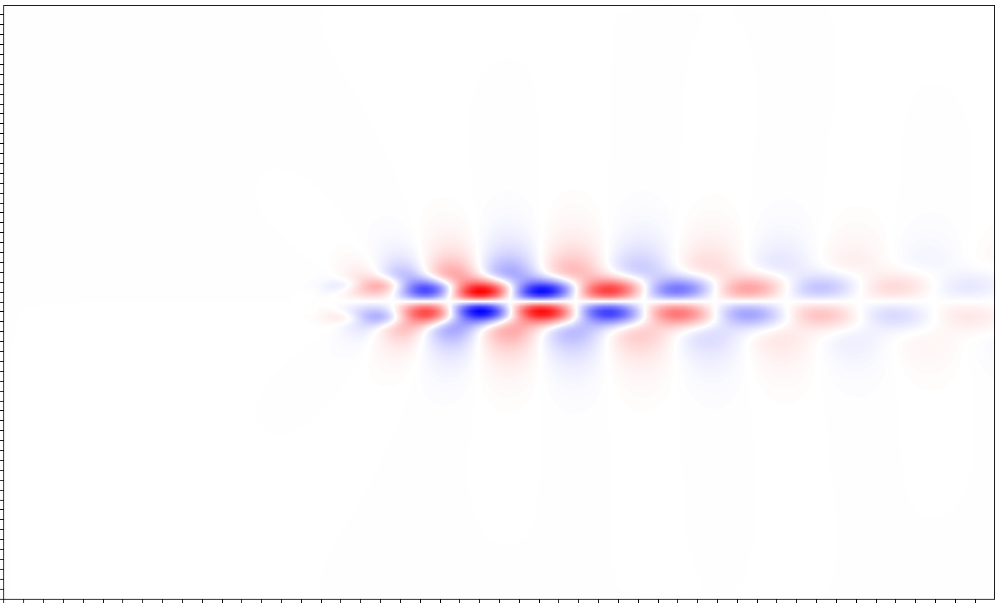

# Using `neko-top` and `LightKrylov` to perform stability analysis
This example demonstrates how the modulararity of both `neko-top` and
[`LightKrylov`](https://github.com/nekStab/LightKrylov) can be utilized to
perform linear stability analysis, attempting to replicate some of the
functionality of either the
[KTH_Framework](https://github.com/KTH-Nek5000/KTH_Framework)
or
[nekStab](https://github.com/nekStab/nekStab) projects with the addition of
GPU acceleration.

Converged in 76 iterations, first few eigenvalues from `eigs_output.txt` are:
```
  Iter                Re                Im           modulus          residual  conv
    76   0.835448073E+00   0.773025754E+00   0.113821892E+01   0.310534793E-07     T
    76   0.835448073E+00  -0.773025754E+00   0.113821892E+01   0.310534793E-07     T
    76   0.698624010E+00   0.687928978E+00   0.980470187E+00   0.533291754E-04     F
    76   0.698624010E+00  -0.687928978E+00   0.980470187E+00   0.533291754E-04     F
    76  -0.589259735E+00   0.401569414E+00   0.713081362E+00   0.157044789E-03     F
    76  -0.589259735E+00  -0.401569414E+00   0.713081362E+00   0.157044789E-03     F
    76  -0.627605141E+00   0.340226066E+00   0.713892141E+00   0.170585614E-03     F
    76  -0.627605141E+00  -0.340226066E+00   0.713892141E+00   0.170585614E-03     F
    76   0.622820196E+00   0.677461348E+00   0.920249354E+00   0.178059467E-03     F
    76   0.622820196E+00  -0.677461348E+00   0.920249354E+00   0.178059467E-03     F
    76  -0.541120962E+00   0.456362159E+00   0.707868855E+00   0.184640696E-03     F
    76  -0.541120962E+00  -0.456362159E+00   0.707868855E+00   0.184640696E-03     F
    76  -0.357995329E+00   0.625994339E+00   0.721130756E+00   0.187603873E-03     F
    76  -0.357995329E+00  -0.625994339E+00   0.721130756E+00   0.187603873E-03     F
    76  -0.656165850E+00   0.276145405E+00   0.711905828E+00   0.195539330E-03     F
```

Leading mode looks reasonable too



\attention I still have a ton of cleaning to do, so don't peep toooo closely
at things like `cylinder.f90` and `driver.f90` :sweat_smile:

## guide for `LightKrylov` and `neko-top` people
`neko-top` is a framework intended to use `neko` as a library to perform topology
optimization. Currently, the linear and adjoint solvers only exist in `neko-top`
and are yet to be migrated to `neko`, hence, this example being run through the
`neko-top` framework. The `setup.sh` script should handle all the external
dependencies related to `neko` compiling and installing them in `external`. These
include
- `neko`
- `json-fortran`
- `gslib`
- `hdf5`

and relies on
- `CMake`

`LightKrylov` requires the additional dependency
- `fpm`

Finally, I used `gmsh` to generate the mesh, so that's one more dependency.

hopefully :pray:, if all goes well, one can run
```bash
git clone --recursive https://github.com/ExtremeFlow/Neko-TOP.git neko-top
cd neko-top
git checkout LightKrylov/linking_dependencies
./setup.sh
./run.sh ext_cyl
```


## Issues on the `neko` / `neko-top` side
The following issues should be addressed before this can be used for production.

- `neko` currently doesn't have a true 2D solver, so there were a lot of hacky
additions that were required to force this flow 2D.
- The linear/adjoint and even non-linear solvers currently still rely heavily
on the field registry, so spawning multiple solvers is still cumbersome.
- Currently this only works for first order time integration, implying something
has gone wrong with the way I'm resetting the adjoint solver between runs.
- A sponge was implemented (in a very hardcoded way) but this should be extended
to a `neko` source term that utilizes the `.case` file properly.
- We currently don't have SFD or `bostconv`, so we can't find our own baseflows
using `neko`.
- If we want to this available to be used by the `LightKrylov` team we need to
update the linear/adjoint solver and migrate them from `neko-top` to `neko`. We
then need to find some kind of `fpm` compatibility.

## Issues on the `LightKrylov` side
I wouldn't say "issues" with `LightKrylov`, but things that are slightly awkward
that have forced me to temporarily fork it as opposed to using the `dev` branch.

This is due to two factors:
-  For the `field_t` in `neko` one must first initialize
using a `dofmap_t`, implying the `abstract_vector` we would use would ideally
have an `init` functionality which could allocate the required fields.
- The frequent use of `intent(out)` for operations using `abstract_vector` types.

Indeed,
before Krylov subspace is allocated, it is followed by a `%zero()`, allowing
us to sneak in an initialization during this call. However, there are still traces
in, for instance, `copy` which piggybacks on `axpby`.

Of course, all these things can be overcome by sneaking little `%init`s throughout
 `zero`, `axpby` etc. It's just a bit awkward.

***However!!!*** at no point am I free'ing any of these fields! So I'm super
confident this prototype is riddled with memory leaks.

Another consideration which must be addressed before moving into production
is how device kernels are launched. Ideally, `neko` favours one BIG kernel
launch as opposed to many small. As it stands, although most operations are
executed on device, they are executed as many small kernel launches. In
future iterations of this project one should rework some of the additional
procedures avaiable by LightKrylov, especially those that are combinations
or accumulations of type bound procedures. i.e., I'm pretty confident something
like a `linear_combination` can be launched as a single kernel, as opposed to
many individual kernels.


However, at the end of the day, given the majority of the heavy lifting
(in terms of compute resources) is being doing by the exponential propogator,
the linear algebra pales in comparison and so perhaps these considerations
are a moot point.

# Concluding remarks
Overall, this has been a very nice demonstration of the abstractness of
`LightKrylov` and the modularity of `neko`, and shows promising potential for
performing stability related analysis with GPUs.

However, one must be cautious that, although all operations are executed on device,
much of the memory dedicated to storing the Krylov subspace is idle during
the execution time of the exponential propogator, ultimately limiting the
efficiency of these tools (again, this is not GPU specific... but an unfortunate
cosequence of memory bound problems such as these)

Excited to see where this goes!!! :stuck_out_tongue_winking_eye:
